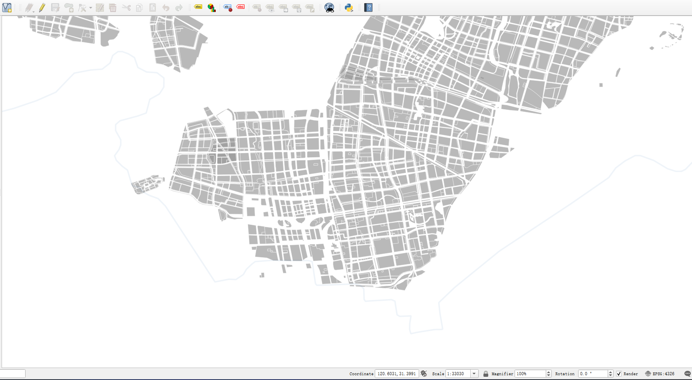
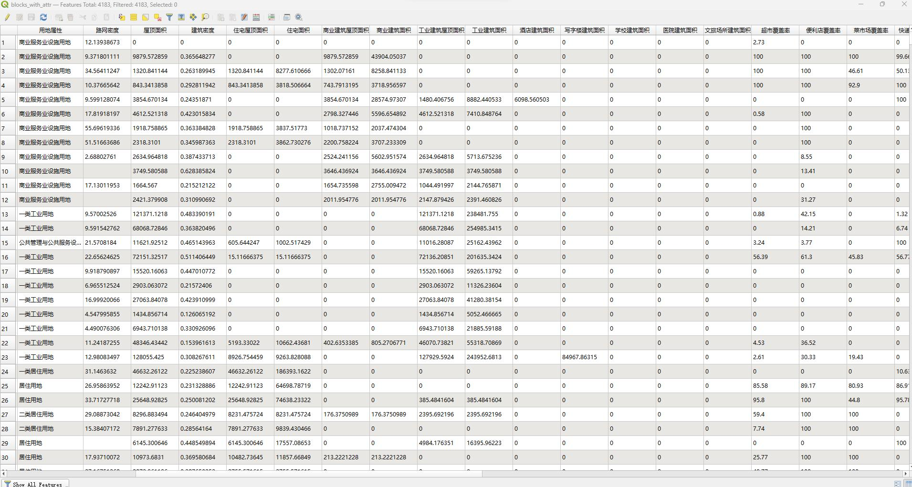
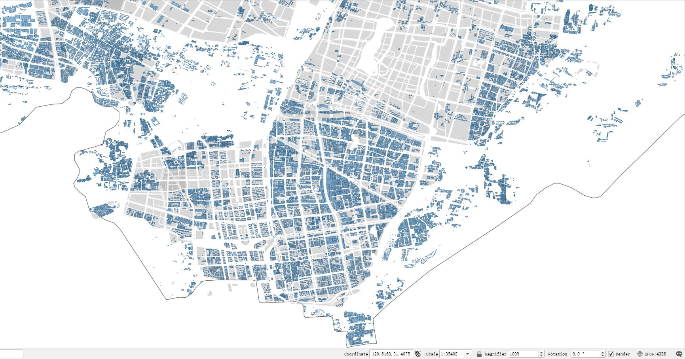
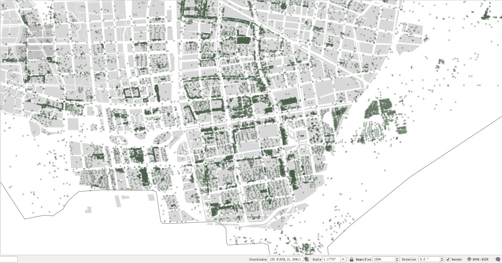

中文版         

# 城市更新指标计算器

### 主要功能

- 地块指标计算 （离散地块）
- 高德POI类型筛选 (eg. 菜市场, 超市, 快递站点...)
- POI buffer后地块的数量计算(intersects)

### 数据样例

- 
- 
- 
- 

### 涵盖指标 (持续施工中)

| 指标名称 | 计算方法 | 数据来源 |
| :-----| ----: | :----: |
| 生活服务设施覆盖率 | buffer 300m | 高德POI |
| 超市覆盖率 | buffer 300m | 高德POI |
| 便利店覆盖率 | buffer 300m | 高德POI |
| 菜市场覆盖率 | buffer 300m | 高德POI |
| 快递站点覆盖率 | buffer 300m | 高德POI |
| 社区服务点覆盖率 | buffer 300m | 高德POI |
| 便民服务设施覆盖率 | buffer 300m | 高德POI |
| 体育设施覆盖率 | buffer 300m | 高德POI |
| 充电站覆盖率 | buffer 1000m | 百度充电桩查询 |
| 充电桩数量 | buffer 1000m | 百度充电桩查询 |
| 加油站覆盖率 | buffer 1000m | 百度加油站查询 |
| 公园绿地覆盖率 | 点位buffer300m，面积buffer500m | 高德poi，百度aoi |
| 轨道站点覆盖率 | buffer 500m | 高德POI |
| 公交站点覆盖率 | buffer 300m | 高德POI |
| 绿地面积 | 地块内，绿地面积占比 | 高德poi，百度aoi |
| 居住小区数量 | buffer 300m | 链家小区 |
| 企业数量 | 地块内企业数量 | 爱企查 |
| 屋顶面积 | 地块内屋顶面积 |  |
| 住宅屋顶面积 |  |  |
| 商业建筑屋顶面积 |  |  |
| 工业建筑屋顶面积 |  | |
| 住宅建成面积 |  |  |
| 商业建筑建成面积 |  |  |
| 公寓建成面积 |  |  |
| 酒店建成面积 |  |  |
| 写字楼建成面积 |  |  |
| 学校建成面积 |  |  |
| 医院建成面积 |  |  |
| 文旅场所建成面积 |  |  |
| 工厂建筑建成面积 |  |  |
| 建筑密度 |  |  |
| 容积率 |  |  |
| 路网密度 | 地块内道路总长度/地块面积 | osm+qq |
