ENGLISH [中文版](./zh-cn.md)  

# Urban Renewal Indicator Calculator (v0.1.0)

## Main Features

-   Calculation of various urban renewal indicators on a parcel level (coverage rate, density, volume, etc.)
-   Regular filtering of certain types of Amap POIs (e.g., markets, supermarkets, delivery sites, etc.)

## Data Samples

- 
- 
- 
- 

## Module Introduction
## 1. Calculator.PointIndex
 -  Calculation of POI coverage rate on a parcel level (e.g., market POI with a 300m buffer, calculating the coverage rate within each parcel)
    -   Algorithmic principles:
        -   
            

                <i>Original POI and parcel data.</i>
            

        -   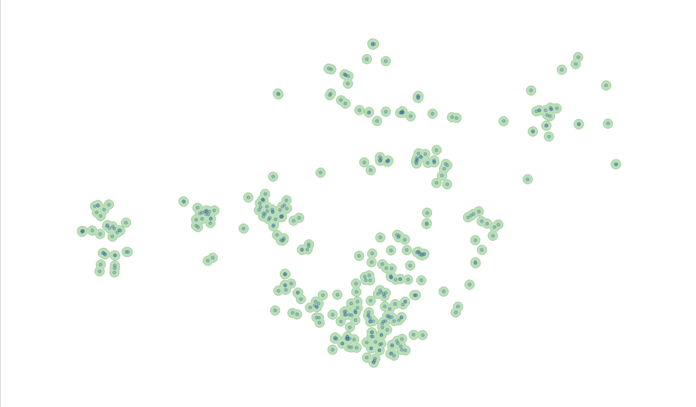 
            

                <i>Generating buffers based on POIs (merging overlapping areas).</i>
            

        -   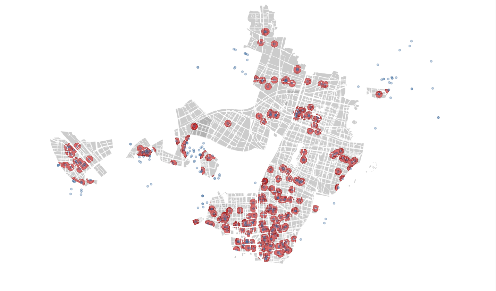 
            

                <i>Extracting the intersection between buffers and parcels.</i>
            
            
        -    
            

                <i>Calculating the buffer area for each parcel and dividing it by the total parcel area to obtain the result.</i>
            
    
 -  Calculation of the number of POIs (buffered) within each parcel (e.g., counting the number of parcels with market buffers of 300m)
(Set the buffer to 0.0001 when no buffer is needed)
    -   Algorithmic principles：
            -   
            

                <i>Original POI and parcel data.</i>
            
   
            -   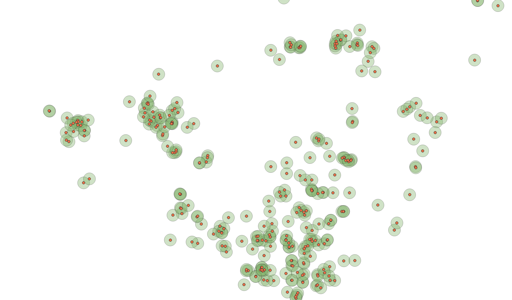 
            

                <i>Generating buffers based on POIs (without merging overlapping areas).</i>
            

            -   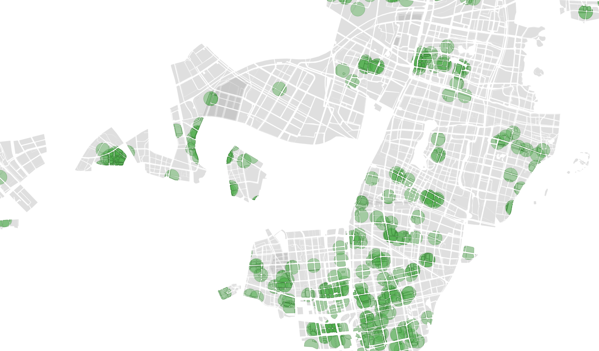 
            

                <i>Extracting the intersection between buffers and parcels (multiple overlapping areas may occur when a parcel is covered by multiple buffers).
                </i>
            

            -   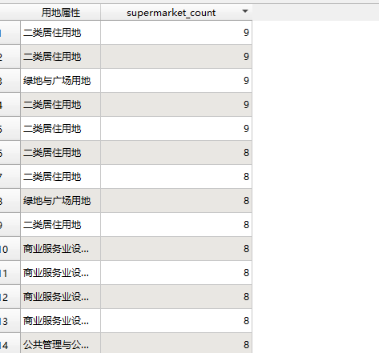 
            

                <i>Counting the number of intersecting buffers for each parcel to obtain the output result.</i>
            

                

## 2. Calculator.LineIndex
 -  Calculation of road network density on a parcel level
    -   Algorithmic principles:
        -   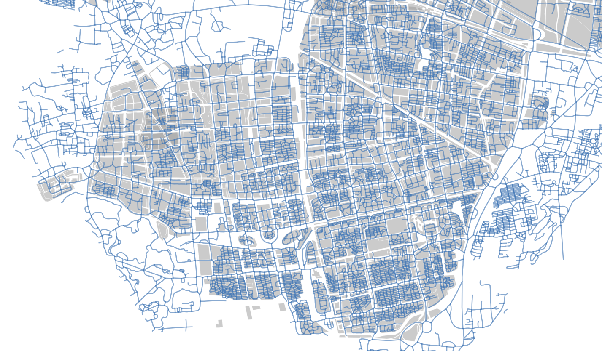
            

                <i>Original road network and parcel data.</i>
            

        -   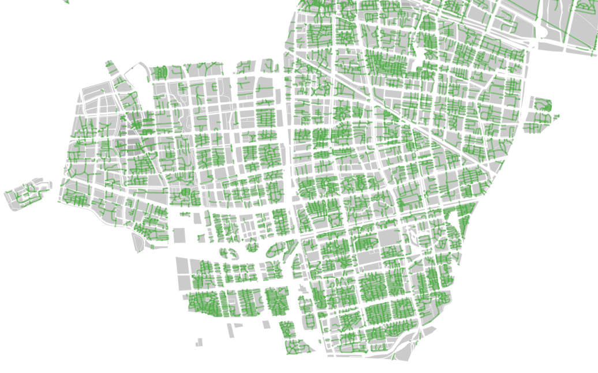 
            

                <i>Extracting the road network portions that overlap with parcels.</i>
            

        -   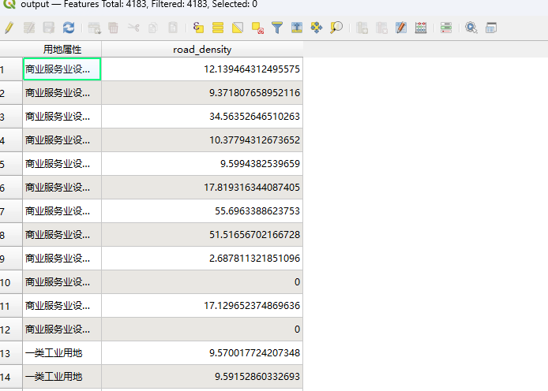 
            

                <i>Extracting the road network portions that overlap with parcels.</i>
            

## 3. Calculator.AoiIndex
-   Calculation of area-based indicators on a parcel level
-   Coverage rate similar to POI
-   Calculation of building floor area for each parcel:
    -   Algorithmic principles:
        -   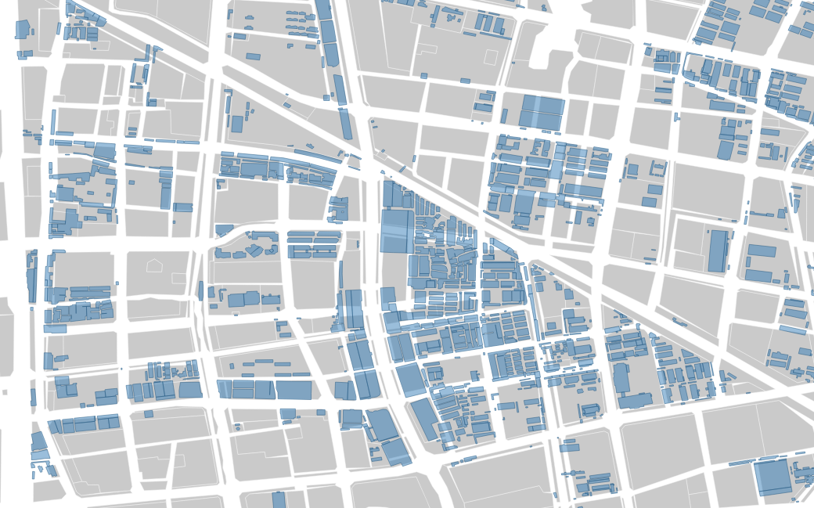
            

                <i>Original building data and parcel data.</i>
            

        -   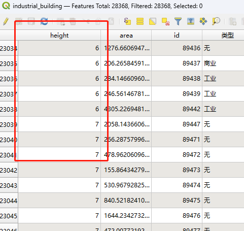
            

                <i>Building data requires a field representing height.</i>
            

        -   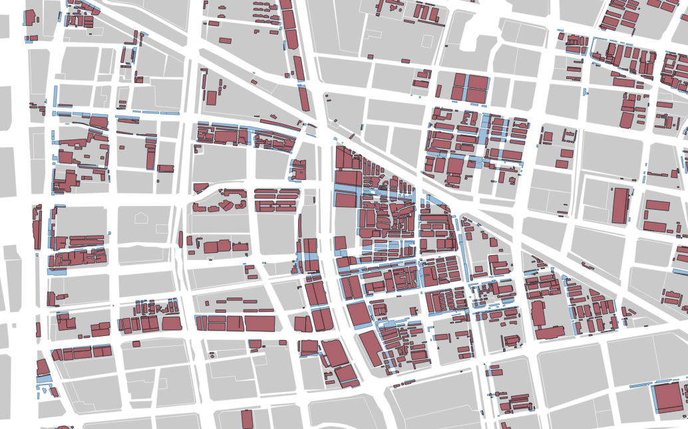 
            

                <i>Extracting the building portions that overlap with parcels (red areas).</i>
            

        -   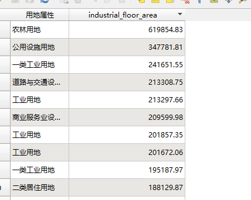 
            

                <i>Calculating the number of floors based on height and obtaining the building area by multiplying the building footprint area by the number of floors.</i>
            

## User Manual
### 1. Environments
-   python 3.x
-   geopandas

### 2. Data Preparation
-   Data Preparation

### 3. Configure config/static_vars.py
-   Configure the paths of the data you want to use. You can comment out or ignore the data that is not needed.

### 4. After modifying the file paths, run the corresponding functions in main.py
-   POI Coverage Rate: Execute the poi_coverage() function and input the corresponding parameters.
-   POI Count: Execute the poi_count() function and input the corresponding parameters.
-   Road Network Density: Execute the road_density() function and input the corresponding parameters.
-   AOI Area: Execute the aoi_area() function and input the corresponding parameters.
-   AOI Coverage Rate: Execute the aoi_coverage() function and input the corresponding parameters.
-   Building Roof Area: Execute the building_roof_area() function and input the corresponding parameters.
-   AOI Building Floor Area: Execute the building_floor_area() function and input the corresponding parameters.

## Concat:
Feel free to email me: kingsleyl0107@gmail.com

